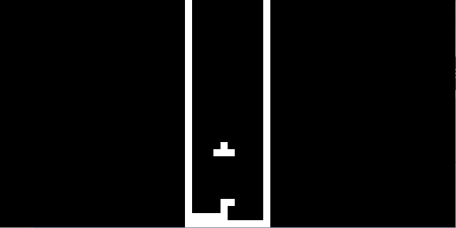
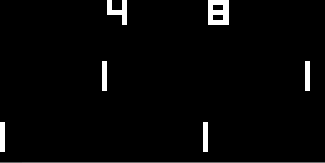

# CHIP-8-emulator
This is an implementation of the CHIP-8 emulator written in C++. The CHIP-8 is a virtual machine that can run CHIP-8 programs (sample programs can be found in roms folder). 

My goal for this project was to build off of the knowledge I gained about writing interpreters from CS146 (Elementary Algorthim Design and Data Abstraction Advanced Level).

**Tetris**



**Soccer**



# How to run
**SDL2** is used for graphics
```
sudo apt-get install libsdl2-dev
```
There are various methods of compiling. Ensure that all files in the **src** folder are included. 
```
g++ -Isrc/Include -Lsrc/lib -o chip8 *.cpp -lSDL2main -lSDL2
```
There are a few parameters to include in order to run. The first is the video scale (CHIP8 is normally 64x32). Second is the CPU delay between cycles (in miliseconds). Last is the ROM file. Below are a few examples with recommended parameters:
```
./chip8 10 1 roms/BC_test.ch8

./chip8 10 3 roms/Tetris.ch8

./chip8 10 3 roms/Soccer.ch8 
```
# Resources
Credits to:
- University of Waterloo CS146 Course Notes 
- Austin Morlan's tutorial: https://austinmorlan.com/posts/chip8_emulator
